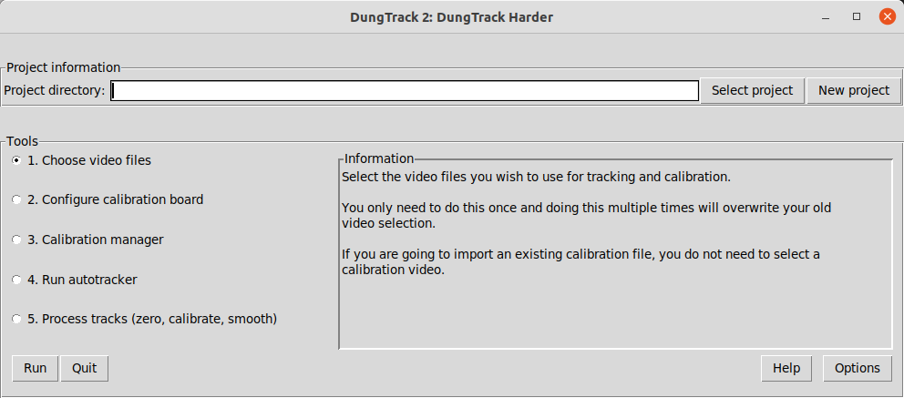

# DungTrack 2

This repo is for the DungTrack2 project wherein we are trying to get a
viable autotracking solution up and running for the dung beetle group.

## Installation
### Prerequisites

This software depends on Python 3 and Pip 3. You must have these
installed to run the software (and install dependencies). 

The prefix `$` indicates a terminal command. You should enter
everything after the dollar sign.

#### Known compatibility problems

If you find any (suspected) compatibility problems, create a new
GitHub issue. They will be added here as appropriate.

- **MacOS 11 Big Sur**: The version of OpenCV which is installed by
    pip is built for MacOS 12 and will not run on Big Sur. You may be
    able to install a specific version which works but you'd need to
    modify `requirements.txt` yourself in order to make this work. The
    format for `requirements.txt` can be found
    [here](https://pip.pypa.io/en/stable/reference/requirements-file-format/).

### Download

1. Click the 'Code' dropdown above.
2. Click 'Download ZIP'
3. Extract the Downloaded zip file and put the folder containing the code somewhere sensible.

You can also clone the repo using Git if you know how to do this.

### Opening a terminal in the right place

You can navigate to the code directory using the command line if you
know how to do this. Otherwise, you can open a terminal via the
graphical file explorer.

You will need to do this every time you want to use the software.

#### MacOS

Open Finder and find the code folder you just downloaded.  Hold
control and click on the folder, then select 'Services' -> 'New
Terminal at Folder'.

A terminal window should open.

#### Linux (Ubuntu)

Open your file explorer, find the code folder you just downloaded.
Right click and select 'Open in Terminal'.

This may be distribution dependent.

### Installing dependencies

If working with Linux then make sure python3-venv and python3-tk are
installed. On Ubuntu:

`$ sudo apt install python3-venv python3-tk`

These are included by default on MacOS and may be included by default
in other linux distros.

The dependencies can be installed using a bash script. Make sure the
terminal is open in the software directory, then run:

`$ ./SETUP`

This script will check for Python 3 and Pip installations, set up a
virtual environment within the software directory, install the
dependencies into the virtual environment, and create a launcher. If
you open the file in a text editor you can see the source.

Once the setup process is complete, run: 

`$ ./dtrack2` 
   
The main window should open:

Click on "Help" for more information. This should open the DTrack2 documentation
in your web browser.

**Setup and launcher scripts**

To ease usage, python, pip, and virtual environment management are
wrapped in bash scripts. If you don't want to use these, then the
dependencies can be installed with

`$ pip3 install -r requirements.txt`

and the software can be run using:

`$ python3 main.py`

*If you're trying to use the setup script and it doesn't work, post an issue!*

